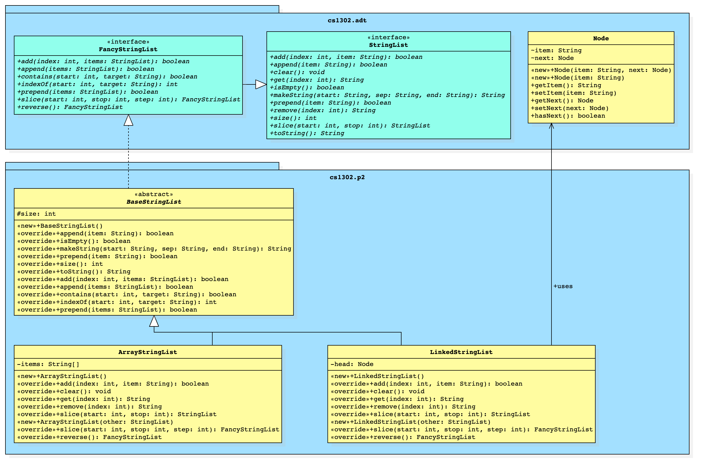

# CSCI 1302 - Phased List (Phase 2) v2021.sp


This document contains the description for Phase 2 of the List ADT
project assigned to the students in the Spring 2021 CSCI 1302 classes
at the University of Georgia.

## Deadline Options

There are different deadline options for this project. Students who
perform their final submission via the `submit` command before the date/times listed
below automatically receive the associated Submission-Based (SB) extra credit. The
late penalty does not start applying until after the final date listed.

* **SAT 2021-03-27 (Mar 27) @ 11:55 PM EST (`+10` SB Extra Credit)**
* **SUN 2021-03-28 (Mar 28) @ 11:55 PM EST (`+5` SB Extra Credit)**
* **MON 2021-03-29 (Mar 29) @ 11:55 PM EST (`+0` SB Extra Credit)**

**Read the entirety of this file before beginning your project.**

**Seriously. Read this entire file *before* starting.**

## Table of Contents

* [Course-Specific Learning Outcomes](#course-specific-learning-outcomes)
* [Academic Honesty](#academic-honesty)
* [Updates](#updates)
* [Project Description](#project-description)
* [Project Requirements & Grading](#project-requirements--grading)
  * [Functional Requirements](#functional-requirements)
  * [Non-Functional Requirements](#non-functional-requirements)
  * [Absolute Requirements](#absolute-requirements)
* [How to Download the Project](#how-to-download-the-project)
* [Submission Instructions](#submission-instructions)
* [Appendix - Suggested Checklist](#appendix---suggested-checklist)
* [Appendix - FAQ](#appendix---faq)

## Course-Specific Learning Outcomes

* **LO1.c:** Create and modify text files and source code using a powerful terminal-based text editor such as Emacs or Vi.
* **LO1.d:** Use shell commands to compile new and existing software solutions that are organized into multi-level
  packages and have external dependencies.
* **LO2.a:** (Partial) Identify redundancy in a set of classes and interfaces, then refactor using inheritance and polymorphism
  to emphasize code reuse.
* **LO2.b:** Define, throw, and propagate exceptions appropriately in a software solution.
* **LO2.d:** (Partial) Implement new generic methods, interfaces, and classes in a software solution.
* **LO3.a:** Create and update source code that adheres to established style guidelines.
* **LO3.b:** Create class, interface, method, and inline documentation that satisfies a set of requirements.
* **LO4.a:** Design, create and use interfaces in a software solution.
* **LO4.b:** Utilize interface-based polymorphism in a software solution.
* **LO4.c:** (Partial) Design, create and use inheritance relationships in a software solution.
* **LO7.c:** (Partial) Use common abstract data types and structures, including lists, queues, arrays, and stacks in solving
  typical problems.

## Academic Honesty

**You agree to the Academic Honesty policy as outlined in the course syllabus.**
In accordance with this notice, I must caution you **not** to
fork this repository on GitHub if you have an account. Doing so will more than
likely make your copy of the project publicly visible. Please follow the instructions contained
in the [How to Download the Project](#how-to-download-the-project)
section below in order to do your development on odin. Furthermore, you must adhere
to the copyright notice and licensing information at the bottom of this document.

## Updates

If there has been an update and you have already cloned the project to Odin,
then you can update your copy of the project using the <code>$ git pull</code>
command while inside of your project directory.

* **2021-03-20-SAT:** Updated `FancyOracleStringList` in `phase2.jar` to fix a potential
  bug in `reverse` and `append`. Students can use `git pull origin main` to get an
  updated copy of `phase2.jar` or use `wget`
  with [this URL](https://github.com/cs1302uga/cs1302-phased-list2/raw/main/phase2.jar).

## Project Description

You will be extending the previous phase of the
[phased list](https://github.com/cs1302uga/cs1302-phased-list/blob/main/README.md)
project by adding new functionality (methods) to your classes. In this project, your `BaseStringList`
class will implement the `FancyStringList` interface which is an extension of the `StringList` interface
implemented in phase 1.

You are required to update your two different classes that
implement the same interface via a common abstract parent. While the specific
details are listed later in this document, the following diagram illustrates the
general relationship between your classes and the interface. The package `cs1302.adt`
is provided for you in the `phase2.jar` file which is included in the download for the
project (details later). You do not have access to the source
code for classes in `cs1302.adt`. However, you do have access to the _byte code_ and the generated API documentation
for the [`FancyStringList` interface](https://webwork.cs.uga.edu/~mepcott/cs1302-phased-list/2/cs1302/adt/FancyStringList.html).
Implementors should make sure that each method functions or behaves as described
by the interface's API documentation.



Implementors are always free to implement additional methods in addition
to the ones defined by the interface. However, they should not assume that
users (e.g., graders) will use these additional methods (even if declared with
`public` visibility), since they are not defined in the interface. These additional
methods may help avoid redundancy and promote code reuse within an implementation.

Based on discussions with past students, we have prepared a
[Suggested Checklist](#appendix---suggested-checklist) section in the Appendices which
contains some suggestions on how to work through the project from start to finish.

### Suggested Reading

* [Interfaces Tutorial](https://github.com/cs1302uga/cs1302-tutorials/blob/master/interfaces/interfaces.md)
* [ADTS and Lists Tutorial](https://github.com/cs1302uga/cs1302-tutorials/blob/master/adt-and-links/adt-and-links.md)
* [API Documentation for Phase 2 Starter Code](https://webwork.cs.uga.edu/~mepcott/cs1302-phased-list/2/index.html)

## Project Requirements & Grading

This assignment is worth 100 points. The lowest possible grade is 0, and the
highest possible grade is 110 (due to extra credit).

### Functional Requirements

A functional requirement is *added* to your point total if satisfied.
There will be no partial credit given for visual inspection of your code.
Points are assigned for each test case that executes properly.

The specific requirements for each class are presented below.

* **`BaseStringList`:** Update your abstract `cs1302.p2.BaseStringList` class such that it properly
  implements a subset of the abstract methods of `FancyStringList`. Since `BaseStringList` is abstract, it is
  not mandatory to implement all methods of `FancyStringList` within this class. The exact list of methods this class
  must implement are listed in the method section for `BaseStringList` in the provided UML diagram above.
  Remember, since `BaseStringList` is an abstract parent to both `ArrayStringList` and `LinkedStringList`,
  it's methods must be implemented without reference to the underlying data structure. In other words,
  within `BaseStringList`, you should not use arrays or nodes. The code contained in this class must be
  general enough to work with both.

  * **Note:** The methods that are listed in the UML diagram in `BaseStringList` must be implemented
    in that class. You are not allowed to move any of them into `ArrayStringList` or `LinkedStringList`.
    You may, however, find that you can more one or more methods from `ArrayStringList` and `LinkedStringList`
    up into `BaseStringList`. Moving methods up is allowed. In fact, it is encouraged. Any method that you can
    move up only has to be written once! However, accomplishing this will require some thought. We hope that
    all of you spend some time trying to ensure that `ArrayStringList` and `LinkedStringList` only contain the
    methods that absolutely need to be implemented in the child classes!

* **`ArrayStringList`:** Update your `cs1302.p2.ArrayStringList` class such
  that it properly extends `cs1302.p2.BaseStringList` and fully implements
  the `cs1302.adt.FancyStringList` interface with additional requirements listed below.

  * You must explicitly define and document a default constructor for this class.
    The implementation of this constructor should not change for this phase.

  * You must explicitly define and document a copy constructor for this class.
    It should make the new list a deep copy of the other list. Therefore, the initial
    size and element values of the new list should be copied from the other list. The other
    list can be any implementation of the `StringList` interface (Yes, you could pass in
    a reference to a `LinkedStringList` object and it would still work properly). Here is
    the signature:

    ```java
    public ArrayStringList(StringList other);
    ```

  * Over the lifetime of an `ArrayStringList` object, its internal storage may
    change in order to accomodate more list elements. The rules regarding updating the internal
    array size for an `ArrayStringList` object are not changed in phase 2.

  * There is a requirement related to this class's storage included
    in the [Absolute Requirements](#absolute-requirements) section.

* **`LinkedStringList`:** Create the `cs1302.p2.LinkedStringList` class such
  that it properly extends `cs1302.p2.BaseStringList` and fully implements
  the `cs1302.adt.FancyStringList` interface with additional requirements listed below.

  * You must explicitly define and document a default constructor for this class.
    The implementation of this constructor should not change for this phase.

  * You must explicitly define and document a copy constructor for this class.
    It should make the new list a deep copy of the other list. Therefore, the initial
    size and element values of the new list should be the other list. The other
    list can be any implementation of the `StringList` interface. Here is
    the signature:

    ```java
    public LinkedStringList(StringList other);
    ```

  * There is a requirement related to this class's storage included
    in the [Absolute Requirements](#absolute-requirements) section.

* **(100 points) Test Cases**: The bulk of this project will be graded
  based on approximately 50 test cases, each worth approximately 2 points.
  This is the same as someone using the classes you wrote based purely on
  the interface definitions. If you implement the interface correctly,
  then you should pass the associated test cases.

### Non-Functional Requirements

A non-functional requirement is *subtracted* from your point total if
not satisfied. In order to emphasize the importance of these requirements,
non-compliance results in the full point amount being subtracted from your
point total. That is, they are all or nothing.

* **(0 points) [RECOMMENDED] No Static Variables:** Use of static variables
  is not appropriate for this assignment. However, static constants are
  perfectly fine.

* **(20 points) Code Style Guidelines:** You should be consistent with the style
  aspect of your code in order to promote readability. Every `.java` file that
  you include as part of your submission for this project must be in valid style
  as defined in the [CS1302 Code Style Guide](https://github.com/cs1302uga/cs1302-styleguide).
  All of the individual code style guidelines listed in that document are part
  of this single non-functional requirement. Like the other non-functional
  requirements, this requirement is all or nothing.

  **NOTE:** The [CS1302 Code Style Guide](https://github.com/cs1302uga/cs1302-styleguide)
  includes instructions on how to use the `check1302` program to check
  your code for compliance on Odin.

* **In-line Documentation (10 points):** Code blocks should be adequately documented
  using in-line comments. With in-line comments, you should explain tricky, large, complicated,
  or confusing blocks of code. This is especially necessary whenever a block of code
  is not immediately understood by a reader (e.g., yourself or the grader). You might also
  include information that someone reading your code would need to know but not someone using it
  (that is more appropriate for a Javadoc comment). A good heuristic for this: if you can imagine that,
  after six months, you might not be able to tell in under a few seconds what a code block is doing,
  then then you probably need to write some in-line comments.

### Absolute Requirements

An absolute requirement is similar to a non-functional requirement, except that violating
it will result in an immediate zero for the assignment. In many cases, a violation
will prevent the graders from evaluating your functional requirements. No attempts will be
made to modify your submission to evaluate other requirements.

* **Project Directory Structure:** <a id="struct"/>The location of the default
  package for the source code should be a direct subdirectory of
  `cs1302-phased-list2` called `src`. When the project is compiled,
  the `-d` option should be used with `javac` to make the default package
  for compiled code a direct subdirectory of `cs1302-phased-list2`
  called `bin`.

  If you follow this structure, then you would type the following to compile
  `BaseStringList.java` to the `bin` directory, assuming you are in the top-level project
  directory `cs1302-phased-list2`:

  ```
  $ javac -d bin -cp phase2.jar src/cs1302/p2/BaseStringList.java
  ```

  Remember, when you compile `.java` files individually, there might be
  dependencies between the files. In such cases, the order in which you
  compile the code matters. Also, if more than one default package is needed
  (e.g., `phase2.jar` and some other directory like `bin`), then a colon `:`
  can be used to separate each path in a list of multiple paths supplied
  to `-cp` (e.g., `-cp phase2.jar:bin`). Since `ArrayStringList` and `LinkedStringList`
  depend on files in `phase2.jar` and `BaseStringList` (in `bin`), we need
  both to be on the classpath as we did in phase 1.

* __Development Environment:__ This project must be implemented
  in Java 11, and it *must compile and run* correctly on Odin using the specific
  version of Java 11 that is setup according to the instructions provided
  by your instructor.

  If you decide to introduce additional `.java` files into your project,
  then they are expected to fulfill all non-functional and absolute requirements,
  even if the main parts of the project do not use them. You may assume
  graders will compile your source code in an order that satisfies
  compilation dependencies. **You should remove any `.java` files that you
  do not need before submission.**

* **`cs1302.p2.ArrayStringList` Storage Requirement:**
  You must use a basic Java array for this class's storage. The initial
  size of the array does not have to be the same size as the initial size
  of the list. Whenever the size of the list is about to exceed the size
  of its array, the list should dynamically allocate a new array of a larger
  size and copy the contents over--please consider writing and documenting
  a private support method to do this. If you use Java's `java.util.ArrayList`
  class or something similar, then that will result in an immediate violation
  of this non-functional requirement, regardless of any use of a regular
  array elsewhere in the class. This requirement also prohibits any use of
  third-party implementations of list or list-like interfaces.

* **`cs1302.p2.LinkedStringList` Storage Requirement:**
  You must use a sequence of `cs1302.adt.StringList.Node` objects
  for this class's storage. Unlike the array-based implementation in
  `ArrayStringList`, this type of storage is not limited to the number
  of elements that can fit into an array (because there is no underlying array).
  Instead, it's limited only by the available memory for the Java program
  using the `LinkedStringList` object.
  If you use Java's `java.util.LinkedList` class or something similar, then that
  will result in an immediate violation of this non-functional requirement,
  regardless of any use of any `Node` objects elsewhere in the class.
  This requirement also prohibits any use of third-party implementations
  of list or list-like interfaces.

* **No Implementation Dependencies:** <a id="no-impl-deps"/>You are not permitted to use one
  implementation of the `StringList` interface in another implementation.
  For example, you cannot use the `ArrayStringList` class inside of your
  `LinkedStringList` class or vise versa. Additionally, `BaseStringList`
  cannot depend on either of the `StringList` implementations, however,
  it can (and should) depend on the `StringList` interface itself. If you have any
  questions about this, then please ask your instructor.

  You can check this using the `jdeps` tool. Inspect the output of
  the command below after everything is compiled. You don't want to see
  `ArrayStringList` pointing to `LinkedStringList` or vise-versa.

  ```
  $ jdeps -v -cp phase2.jar bin
  ```

### Grading

This project will be graded using unit tests, none of which will be made
available before the project deadline. You can test your implementations yourself
via interface polymorphism.

## How to Download the Project

On Odin, execute the following terminal command in order to download the project
files into sub-directory within your present working directory:

```
$ git clone --depth 1 https://github.com/cs1302uga/cs1302-phased-list2.git
```

This should create a directory called `cs1302-phased-list2` in
your present working directory that contains a clone of the
project's respository. We recommend copying the code from your phase 1 directory (`cs1302-phased-list`)
into this newly created directory.

If any updates to the project files are announced by your instructor, you can
merge those changes into your copy by changing into your project's directory
on Odin and issuing the following terminal command:

```
$ git pull
```

If you have any problems with these download procedures, then please contact
your instructor.

## ListADT Testing

You are responsible for implementing test cases to test your `ArrayStringList` and `LinkedStringList` classes. There are
a few examples of test cases provided in the checklist and FAQ sections below.

Additionally, we have provided an oracle class (`cs1302.oracle.OracleStringList`) that you can instantiate and use
in your driver program. The oracle will allow you to run test cases that you write using a trusted implementation of
`StringList` so you can compare the oracle output to the output of your `StringList` implementations.

Here is an example `Driver` class that us set up to run the test cases with all three implementation. You would just need
to uncomment the implementation you wanted to use:

```java
package cs1302.p2;

import cs1302.adt.StringList;
import cs1302.oracle.OracleStringList;

public class Driver {
    public static void main(String[] args) {
        StringList sl;

        // To test what the output is for your code, you can use ArrayStringList or LinkedStringList:
	// sl = new OracleStringList(); // uncomment to run the test cases using the oracle.
	// sl = new ArrayStringList(); // uncomment to run the test cases using your array implementation
	// sl = new LinkedStringList(); // uncomment to run the test cases using your linked implementation.

        // Test isEmpty on an empty list
        if (sl.isEmpty()) {
            System.out.println("isEmpty: Test Passed");
        } else {
            System.out.println("isEmpty: Test Failed");
            System.exit(0);
        } // if

	// more calls to test methods down here...
    } // main

} // Driver
```

<!--

## ListADT Tester

Run public test cases for the cs1302-phased-list project. This program assumes
that your code compiles correctly, the default location for compiled code
is 'bin', and 'phase2.jar' is in the current directory.

Options:
    -a | --ArrayStringList     Check and test cs1302.p2.ArrayStringList
    -l | --LinkedStringList    Check and test cs1302.p2.LinkedStringList
    --help                     Show this help information (ignore other options)
```

You can test your `ArrayStringList` class, `LinkedStringList` class, or both.
For example, to just test `ArrayStringList`, you can run:

```
$ listadt-tester -a
```

If you have any questions, please feel free to ask on Piazza.

-->

## Submission Instructions

You will be submitting your project via Odin before the deadline indicated
near the top of this document. Make sure your project files
are on `odin.cs.uga.edu`. Change into the parent directory of your
project directory. If you've followed the instructions provided in this document,
then the name of your project directory should be `cs1302-phased-list2`.
While in your project's parent directory, execute the following command:

```
$ submit cs1302-phased-list2 csci-1302
```

If you have any problems submitting your project then please send a private
post to your instructor via the course Piazza as soon as possible. However,
creating a post about something like this the day or night the project is due
is probably not the best idea.

# Appendix - Suggested Checklist

To help you with planning out this project, here are some suggested steps you
can take that your instructors believe will help you complete the project more
easily. Some of the items in this checklist may not make sense until you have
read the entire project description, including the [FAQ](#appendix---faq).
These steps are suggesions and, therefore, do not constitute an exhaustive list
of steps that you may need to take to complete the project.

1. Preparation:

   - [ ] Read through the entire project description, including the appendices,
         **and write down questions as you go**.
   - [ ] Read through the entire [API Documentation for `FancyStringList`](https://webwork.cs.uga.edu/~mepcott/cs1302-phased-list/2/cs1302/adt/package-summary.html),
         **and write down questions as you go**.
	 * Be sure to read both the summary comment for each method and its detailed
	   description (which can be reached by clicking on it).
   - [ ] Read both of them again! This time, you may be able to answer some of your own questions.

1. Before you write any code:

   - [ ] For each method in the interface, make sure you understand how to call each method and what a user
         expects to happen when calling that method on an object of an implementing class. For example, what
	 would occur if the driver program executed the line `sl.append("end")` on a preexisting object of
	 a class that implements `FancyStringList`?
   - [ ] For each method in the interface, try to write down what you
         think the basic steps need to be in order to produce the desired outcome.
	 * Try to keep it high level. If the steps that you write down sound like they
	   can be accomplished with another method, then replace those steps with
	   a note to refer to that method. If that other method does not yet exist,
	   then you might introduce that as a _private_ or _protected_ helper method.
	 * Here is an example: If there are multiple methods that have a step that
	   gets an element from a specific index in the list, then you might have
	   that method call the list's [`get`](https://webwork.cs.uga.edu/~mepcott/cs1302-phased-list/1/cs1302/adt/StringList.html#get(int))
	   method instead of directly accessing the underlying data structure (array or linked list).
	 * Consider drawing out diagrams similar to the diagrams to the provided
	 [Examples](https://github.com/cs1302uga/cs1302-tutorials/blob/master/adt-and-links/adt-and-links.md#list-adt---examples-with-both-implementations).
   - [ ] Based on the previous suggestion, draw out what the method dependencies
         are for each method (i.e., what method depends on what). If you notice
	 any circular dependencies, then those should be eliminated.
	 * The methods that don't depend on other methods are good candidates to
	   start with in the next phase of your development. We'll call these the
	   independent methods.

1. Prepare to implement the methods:

   - [ ] Update the `.java` files for each implementing class and the common parent (`BaseStringList`) and make sure all classes
         are in the correct package and all entities have the proper visibility.
	 * You can copy your files from phase 1 into your new directory as a starting point. Make sure and modify any interface/inheritance
	   relationships to match the new UML diagram.
	 * Add the new method signatures to the appropriate class based on the UML diagram for this phase.
	 * In the body of each method, write the `throw` statement that is suggested
	   in [the FAQ](#faq-uoe). **Do not attempt to actually implement the method yet.**
	 * Run `checkstyle` to make sure that you're off to a good start, style-wise.
	   **Yes, this includes Javadoc comments;** read [this](https://github.com/cs1302uga/cs1302-styleguide/blob/master/README.md#missingjavadocmethod)
	   for a recommended way to handle the inherited documentation.
	 * Make sure the files compile, even though they're not really implemented yet. We recommend making a compile script to simplify
	   compilation in the future. This will make it easier to test/debug your code.

1. Implement the new methods in each class. In this phase, we will leave the exact order up to you.
   - [ ] For each of the methods, attempt to write them.
	 * Not only should you implement these methods, but **you should test them too**.
	   Add code to your driver program that creates a list object, calls each methods,
	   and make sure that they work. When you create a test method, have the method
	   perform it's test on a `FancyStringList` instead of an `ArrayStringList`. That
	   way, you'll know that it works from the perspective of the interface.
	 * When testing, you should rerun all previous tests and make sure they still
	   work. This iterative process of testing code is sometimes called
	   _regression testing_. You may need to go back and fix a bug in a method
	   you have already written.
         * Run `checkstyle` to make sure that you're still good, style-wise.
	 * Don't forget to `git commit` whenever you get something to work.
   - [ ] Repeat the last step until you have all methods implemented.

1. Final Run-through:
   - [ ] Thoroughly test all of your methods on objects of both `ArrayStringList` and `LinkedStringList`.
   - [ ] Remember to run `check1302` often and commit changes as you fix bugs.
   - [ ] Your driver program does not need to be submitted. If you choose to submit it, you must make sure it compiles and passes
         the checkstyle audit.

# Appendix - FAQ

For our responses to frequently asked questions, please refer to
the [Phase 1 FAQ](https://github.com/cs1302uga/cs1302-phased-list/blob/main/README.md#appendix---faq)

Have a question? Please post it on the course Piazza.

<hr/>

[](http://creativecommons.org/licenses/by-nc-nd/4.0/)

<small>
Copyright &copy; Michael E. Cotterell and the University of Georgia.
This work is licensed under a <a rel="license" href="http://creativecommons.org/licenses/by-nc-nd/4.0/">Creative Commons Attribution-NonCommercial-NoDerivatives 4.0 International License</a> to students and the public.
The content and opinions expressed on this Web page do not necessarily reflect the views of nor are they endorsed by the University of Georgia or the University System of Georgia.
</small>
